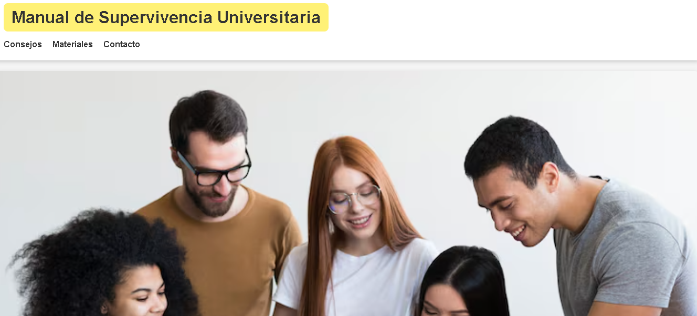
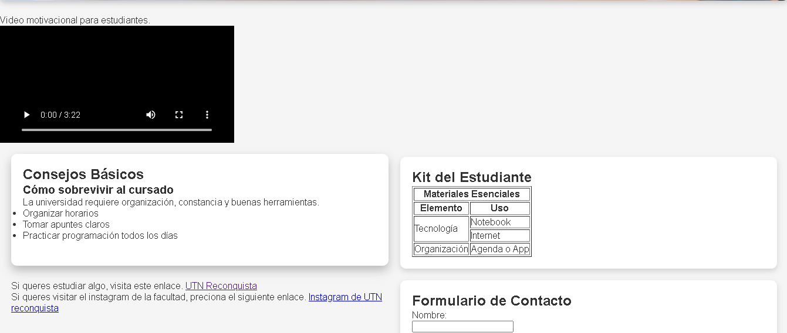
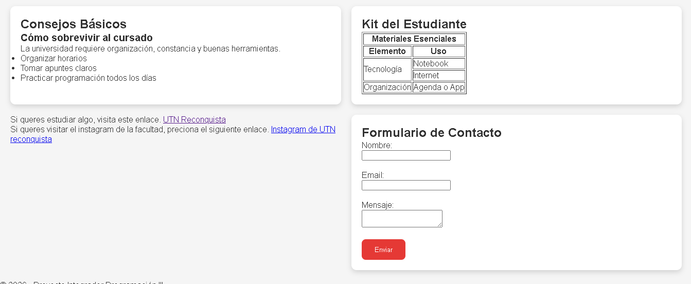

# Mi proyecto Web de manual de supervivencia a la univercidad (cuatrimestral)

## Descripción
Este proyecto se trata de un manual de supervivencia para la univercidad.

## Contenido
- Menú principal
- Consejos básicos
- Imágen de personas estudiando
- Kit del estudiante
- Formulario de contacto
- Enlace a la pagina de la UTN reconquista
- Enlace al instagram de la UTN reconquista

## Autor
Adriel Scheidegger
### Vista escritorio

